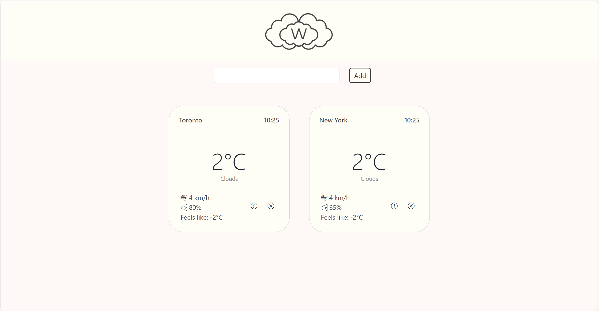

---

# Weather Report App


## Get started

Step 1. Install the dependencies...

```bash
cd weather-tiempo
npm install
```

Step 2. Create `.env` in root directory and set the weather api key.

```
API_KEY = your_weather_api_key
```

Step 3. Run `npm run dev`, then navigate to [localhost:8080](http://localhost:8080). 



